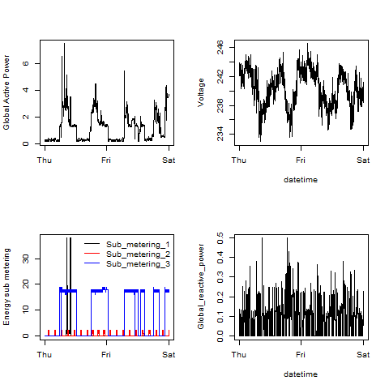

## Exploratory Analysis Project 1

The task for this project was to reconstruct the plots below, all of which were constructed using the base plotting system.

This repo contains 8 files, 4 PNG files and 4 R code files.

The code files include code for downloading and reading the data so that the plot can be fully reproduced.

## Introduction

This assignment uses data from
the <a href="http://archive.ics.uci.edu/ml/">UC Irvine Machine
Learning Repository</a>, a popular repository for machine learning
datasets. In particular, we will be using the "Individual household
electric power consumption Data Set"

* <b>Dataset</b>: <a href="https://d396qusza40orc.cloudfront.net/exdata%2Fdata%2Fhousehold_power_consumption.zip">Electric power consumption</a> [20Mb]

* <b>Description</b>: Measurements of electric power consumption in
one household with a one-minute sampling rate over a period of almost
4 years. Different electrical quantities and some sub-metering values
are available. 

## Data Summary

<b>power_cons</b>: subset of the "Individual household electric power consumption Data Set" for the dates 2007-02-01 and 2007-02-02.

A total of 2880 observations and 9 variables.

The following are the descriptions of the 9 variables in the dataset power_cons: 

<ol>
<li><b>Date</b>: Date in format Date  </li>
<li><b>Time</b>: time in format POSIXct </li>
<li><b>Global_active_power</b>: class num: household global minute-averaged active power (in kilowatt) </li>
<li><b>Global_reactive_power</b>: class num: household global minute-averaged reactive power (in kilowatt) </li>
<li><b>Voltage</b>: class num: minute-averaged voltage (in volt) </li>
<li><b>Global_intensity</b>: class num: household global minute-averaged current intensity (in ampere) </li>
<li><b>Sub_metering_1</b>: class num: energy sub-metering No. 1 (in watt-hour of active energy). It corresponds to the kitchen, containing mainly a dishwasher, an oven and a microwave (hot plates are not electric but gas powered). </li>
<li><b>Sub_metering_2</b>: class num: energy sub-metering No. 2 (in watt-hour of active energy). It corresponds to the laundry room, containing a washing-machine, a tumble-drier, a refrigerator and a light. </li>
<li><b>Sub_metering_3</b>: class num: energy sub-metering No. 3 (in watt-hour of active energy). It corresponds to an electric water-heater and an air-conditioner.</li>
</ol>

## Plots

The four plots that I constructed are below the coursera example:

### Coursera Plot 1

 

### My Plot 1
 

### Coursera Plot 2

 

### My Plot 2
 

### Coursera Plot 3

 

### My Plot 3
 

### Coursera Plot 4

 

### My Plot 4

